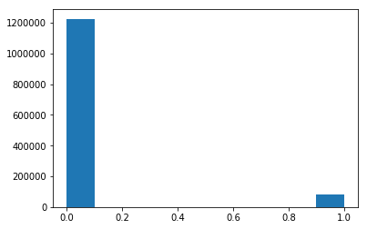
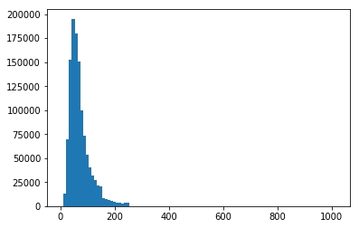
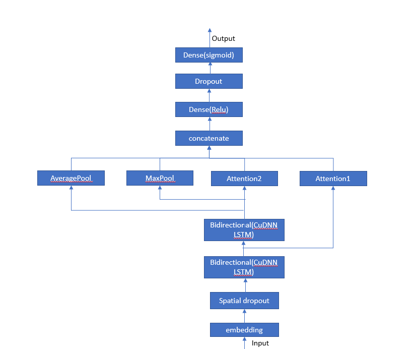
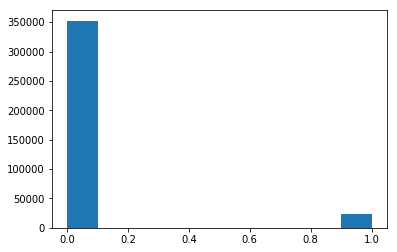

# Overview
Quora is a platform that empowers people to learn from each other. On Quora, people can ask questions and connect with others who contribute unique insights and quality answers. A key challenge is to weed out insincere questions -- those founded upon false premises, or that intend to make a statement rather than look for helpful answers.

* **Target**: In this competition, we will develop models that identify and flag insincere questions.
* **Data**: The training data includes the question that was asked, and whether it was identified as insincere (target = 1). For each qid in the test set, we must predict whether the corresponding question_text is insincere (1) or not (0). 
* **Evaluation metrics**:Submissions are evaluated on F1 Score between the predicted and the observed targets.

# Import and Clean the data
 There are 1,306,122 entries in the training set and 375,806 entries in the test set. In the training data the insincere quetions  accout for 1/10 of all the questions. 


```python
import numpy as np
import pandas as pd

train_df=pd.read_csv("../input/quora-insincere-questions-classification/train.csv")
test_df=pd.read_csv("../input/quora-insincere-questions-classification/test.csv")
train_df.sample(5)
```


<div>
<style scoped>
    .dataframe tbody tr th:only-of-type {
        vertical-align: middle;
    }

    .dataframe tbody tr th {
        vertical-align: top;
    }

    .dataframe thead th {
        text-align: right;
    }
</style>
<table border="1" class="dataframe">
  <thead>
    <tr style="text-align: right;">
      <th></th>
      <th>qid</th>
      <th>question_text</th>
      <th>target</th>
    </tr>
  </thead>
  <tbody>
    <tr>
      <th>394905</th>
      <td>4d5fcc7ab896b6dde80d</td>
      <td>What would happen if all individual minds are ...</td>
      <td>0</td>
    </tr>
    <tr>
      <th>694206</th>
      <td>87fa0dbd94d15a482ad4</td>
      <td>Is NCERT alone enough to score 100+ in chemistry?</td>
      <td>0</td>
    </tr>
    <tr>
      <th>78757</th>
      <td>0f6aade84a72400dd0c8</td>
      <td>Which are the automation colleges in Karnataka?</td>
      <td>0</td>
    </tr>
    <tr>
      <th>766006</th>
      <td>96114e5881b0591bffef</td>
      <td>Who do you think is going to benefit the most ...</td>
      <td>0</td>
    </tr>
    <tr>
      <th>18915</th>
      <td>03b456e37e67ba9d504f</td>
      <td>Why do black women cause a majority of public ...</td>
      <td>1</td>
    </tr>
  </tbody>
</table>
</div>


```python
train_df.info()
```

    <class 'pandas.core.frame.DataFrame'>
    RangeIndex: 1306122 entries, 0 to 1306121
    Data columns (total 3 columns):
    qid              1306122 non-null object
    question_text    1306122 non-null object
    target           1306122 non-null int64
    dtypes: int64(1), object(2)
    memory usage: 29.9+ MB
    


```python
import matplotlib.pyplot as plt
plt.hist(train_df.target)
```


    (array([1225312.,       0.,       0.,       0.,       0.,       0.,
                  0.,       0.,       0.,   80810.]),
     array([0. , 0.1, 0.2, 0.3, 0.4, 0.5, 0.6, 0.7, 0.8, 0.9, 1. ]),
     <a list of 10 Patch objects>)


    

    


```python
test_df.info()
```

    <class 'pandas.core.frame.DataFrame'>
    RangeIndex: 375806 entries, 0 to 375805
    Data columns (total 2 columns):
    qid              375806 non-null object
    question_text    375806 non-null object
    dtypes: object(2)
    memory usage: 5.7+ MB
    

Replace the sepecial symbols by space, convert the string into lowercase and fill the missing values with "_na_"


```python
puncts = [',', '.', '"', ':', ')', '(', '-', '!', '?', '|', ';', "'", '$', '&', '/', '[', ']', '>', '%', '=', '#', '*', '+', '\\', '•',  '~', '@', '£', 
 '·', '_', '{', '}', '©', '^', '®', '`',  '<', '→', '°', '€', '™', '›',  '♥', '←', '×', '§', '″', '′', 'Â', '█', '½', 'à', '…', 
 '“', '★', '”', '–', '●', 'â', '►', '−', '¢', '²', '¬', '░', '¶', '↑', '±', '¿', '▾', '═', '¦', '║', '―', '¥', '▓', '—', '‹', '─', 
 '▒', '：', '¼', '⊕', '▼', '▪', '†', '■', '’', '▀', '¨', '▄', '♫', '☆', 'é', '¯', '♦', '¤', '▲', 'è', '¸', '¾', 'Ã', '⋅', '‘', '∞', 
 '∙', '）', '↓', '、', '│', '（', '»', '，', '♪', '╩', '╚', '³', '・', '╦', '╣', '╔', '╗', '▬', '❤', 'ï', 'Ø', '¹', '≤', '‡', '√', ]
def clean_text(x):
    x = str(x)
    for punct in puncts:
        x = x.replace(punct, f' ')
    return x

def preprocess(df,col):
    df[col] = df[col].str.lower()
    df[col] = df[col].apply(lambda x: clean_text(x))
    df[col] = df[col].fillna("_na_")
    
preprocess(train_df,"question_text")
preprocess(test_df,"question_text")
```

Split the training set into train and validate set.


```python
from sklearn.model_selection import train_test_split
train_df, val_df = train_test_split(train_df, test_size=0.1, random_state=2008)
x_train = train_df["question_text"].values
x_val = val_df["question_text"].values
x_test = test_df["question_text"].values
```

Most of the questons have less than 200 words and the median of the length is around 70 words. Let us set the max length of the question as 80. 


```python
import matplotlib.pyplot as plt
plt.hist([len(item) for item in x_train],bins=100)
plt.show()
```


    

    


# Tokenize the text

Use  Keras to tokenzie the text,  then convert the lists of tokens into sequece. There are 185,320 unique tokens in the train text. I use the top 100,000 words as features by setting MAX_WORDS as 100,000. Since all the pretrained embeddings have  300 dimensions, I set the embedding size as 300.


```python
from keras.preprocessing.text import Tokenizer
from keras.preprocessing.sequence import pad_sequences

MAXLEN=80 # cuts off the text after 100 words
MAX_WORDS=100000 # consider only the top 100,000 words as features
EMBEDDING_DIM=300 # The dimension of the embeddings

tokenizer=Tokenizer(num_words=MAX_WORDS)
tokenizer.fit_on_texts(x_train)
word_index=tokenizer.word_index
print(f'Found {len(word_index)} unique tokens.')

sequences_train=tokenizer.texts_to_sequences(x_train)
x_train_2d=pad_sequences(sequences_train,maxlen=MAXLEN)

sequences_val=tokenizer.texts_to_sequences(x_val)
x_val_2d=pad_sequences(sequences_val,maxlen=MAXLEN)

sequences_test=tokenizer.texts_to_sequences(x_test)
x_test_2d=pad_sequences(sequences_test,maxlen=MAXLEN)

y_train=train_df['target'].values
y_val=val_df['target'].values
```

    Using TensorFlow backend.
    

    Found 185320 unique tokens.
    

#  Load pretrained embeddings
Four pretrianed embeddings are available to use in this competition.


```python
!ls ../input/quora-insincere-questions-classification/embeddings/
```

    GoogleNews-vectors-negative300	paragram_300_sl999
    glove.840B.300d			wiki-news-300d-1M


Import Glove, Fasttext and Para embeddings. 


```python
EMBEDDING_FILE_Glove='../input/quora-insincere-questions-classification/embeddings/glove.840B.300d/glove.840B.300d.txt'
EMBEDDING_FILE_Fasttext='../input/quora-insincere-questions-classification/embeddings/wiki-news-300d-1M/wiki-news-300d-1M.vec'
EMBEDDING_FILE_Para='../input/quora-insincere-questions-classification/embeddings/paragram_300_sl999/paragram_300_sl999.txt'

def load_embeddings(EMBEDDING_FILE,word_index):

    def get_coefs(word,*arr): return word, np.asarray(arr, dtype='float32')    
    
    if EMBEDDING_FILE==EMBEDDING_FILE_Glove:
        embeddings_index = dict(get_coefs(*o.split(" ")) for o in open(EMBEDDING_FILE))
    elif EMBEDDING_FILE==EMBEDDING_FILE_Fasttext:
        embeddings_index = dict(get_coefs(*o.split(' ')) for o in open(EMBEDDING_FILE) if len(o)>100)
    else:
        embeddings_index = dict(get_coefs(*o.split(' ')) for o in open(EMBEDDING_FILE, encoding='utf8', errors='ignore') if len(o)>100)
    print ('Found %s word vectors' % len(embeddings_index))

    all_embs = np.stack(embeddings_index.values())
    emb_mean,emb_std = all_embs.mean(), all_embs.std()
    embeddings_size = all_embs.shape[1]

    embedding_matrix = np.random.normal(emb_mean, emb_std, (MAX_WORDS,embeddings_size))#generate the embedding max with normal distribution 
    for word, i in word_index.items():
        if i >= MAX_WORDS: continue
        embedding_vector = embeddings_index.get(word)
        if embedding_vector is not None: embedding_matrix[i] = embedding_vector# words not found in the embedding index will remain the initial values
    
    return embedding_matrix

embeddings_matrix_glove=load_embeddings(EMBEDDING_FILE_Glove,word_index)
embeddings_matrix_fasttext=load_embeddings(EMBEDDING_FILE_Fasttext,word_index)
embeddings_matrix_para=load_embeddings(EMBEDDING_FILE_Para,word_index)
```

    Found 2196016 word vectors
    

    /opt/conda/lib/python3.6/site-packages/ipykernel_launcher.py:17: FutureWarning: arrays to stack must be passed as a "sequence" type such as list or tuple. Support for non-sequence iterables such as generators is deprecated as of NumPy 1.16 and will raise an error in the future.
    

    Found 999994 word vectors
    Found 1703755 word vectors
    

# Prepare for the model
**The attention mechanism** to overcome the limitation that allows the network to learn where to pay attention in the input sequence for each item in the output sequence.


```python
from keras.engine.topology import Layer
class Attention(Layer):
    def __init__(self, step_dim,
                 W_regularizer=None, b_regularizer=None,
                 W_constraint=None, b_constraint=None,
                 bias=True, **kwargs):
        self.supports_masking = True
        self.init = initializers.get('glorot_uniform')

        self.W_regularizer = regularizers.get(W_regularizer)
        self.b_regularizer = regularizers.get(b_regularizer)

        self.W_constraint = constraints.get(W_constraint)
        self.b_constraint = constraints.get(b_constraint)

        self.bias = bias
        self.step_dim = step_dim
        self.features_dim = 0
        super(Attention, self).__init__(**kwargs)
    
    def (self, input_shape):
        assert len(input_shape) == 3

        self.W = self.add_weight((input_shape[-1],),
                                 initializer=self.init,
                                 name='{}_W'.format(self.name),
                                 regularizer=self.W_regularizer,
                                 constraint=self.W_constraint)
        self.features_dim = input_shape[-1]

        if self.bias:
            self.b = self.add_weight((input_shape[1],),
                                     initializer='zero',
                                     name='{}_b'.format(self.name),
                                     regularizer=self.b_regularizer,
                                     constraint=self.b_constraint)
        else:
            self.b = None

        self.built = True

    def compute_mask(self, input, input_mask=None):
        return None
    def call(self, x, mask=None):
        features_dim = self.features_dim
        step_dim = self.step_dim

        eij = K.reshape(K.dot(K.reshape(x, (-1, features_dim)),
                        K.reshape(self.W, (features_dim, 1))), (-1, step_dim))

        if self.bias:
            eij += self.b

        eij = K.tanh(eij)

        a = K.exp(eij)

        if mask is not None:
            a *= K.cast(mask, K.floatx())

        a /= K.cast(K.sum(a, axis=1, keepdims=True) + K.epsilon(), K.floatx())

        a = K.expand_dims(a)
        weighted_input = x * a
        return K.sum(weighted_input, axis=1)
    
    def compute_output_shape(self, input_shape):
        return input_shape[0],  self.features_dim

```

## Build the model with LSTM and Attention
Since we don't care the direction of the quesitons, we will use the bidrectional LSTM and Attention layes to build the model. The construction of my NN model is as following.


```python
from IPython.display import Image
Image("../input/picture/NN.png")
```


    

    


```python
from keras.layers import Dense, Input, CuDNNLSTM, Embedding, Dropout, Activation, CuDNNGRU, Conv1D
from keras.layers import Bidirectional, GlobalMaxPool1D, GlobalMaxPooling1D, GlobalAveragePooling1D
from keras.layers import Input, Embedding, Dense, Conv2D, MaxPool2D, concatenate, Lambda
from keras.layers import Reshape, Flatten, Concatenate, Dropout, SpatialDropout1D
from keras.optimizers import Adam
from keras.models import Model
from keras import backend as K
from keras.engine.topology import Layer
from keras import initializers, regularizers, constraints, optimizers, layers
from keras.layers import concatenate

def model_lstm_atten(embedding_matrix):
    inp = Input(shape=(MAXLEN,))
    x = Embedding(MAX_WORDS, EMBEDDING_DIM, weights=[embedding_matrix], trainable=False)(inp)
    x = SpatialDropout1D(0.1)(x)
    x = Bidirectional(CuDNNLSTM(40, return_sequences=True))(x)
    y = Bidirectional(CuDNNGRU(40, return_sequences=True))(x)
    
    atten_1 = Attention(MAXLEN)(x)
    atten_2 = Attention(MAXLEN)(y)
    avg_pool = GlobalAveragePooling1D()(y)
    max_pool = GlobalMaxPooling1D()(y)
    
    conc = concatenate([atten_1, atten_2, avg_pool, max_pool])
    conc = Dense(16, activation='relu')(conc)
    conc = Dropout(0.1)(conc)
    outp = Dense(1, activation='sigmoid')(conc)    

    model = Model(inputs=inp, outputs=outp)
    model.compile(loss='binary_crossentropy', optimizer='adam', metrics=['acc'])
    
    return model
```

# Fit and predict

Fit the model with glove embeddings and predict the validation set. Print f1 score corrsponding to thresh from 0.1 to 0.501. 


```python
from sklearn import metrics
model_glove=model_lstm_atten(embeddings_matrix_glove)
model_glove.fit(x_train_2d,y_train,
                   epochs=3,
                   batch_size=512,
                   validation_data=(x_val_2d, y_val))
pred_val_glove = model_glove.predict([x_val_2d], batch_size=1024, verbose=1)
for thresh in np.arange(0.1, 0.501, 0.01):
    thresh = np.round(thresh, 2)
    print("F1 score at threshold {0} is {1}".format(thresh, metrics.f1_score(y_val, (pred_val_glove>thresh).astype(int))))
```

    Train on 1175509 samples, validate on 130613 samples
    Epoch 1/3
    1175509/1175509 [==============================] - 104s 88us/step - loss: 0.1199 - acc: 0.9537 - val_loss: 0.1043 - val_acc: 0.9578
    Epoch 2/3
    1175509/1175509 [==============================] - 101s 86us/step - loss: 0.1046 - acc: 0.9588 - val_loss: 0.1002 - val_acc: 0.9598
    Epoch 3/3
    1175509/1175509 [==============================] - 101s 86us/step - loss: 0.0999 - acc: 0.9603 - val_loss: 0.0985 - val_acc: 0.9604
    130613/130613 [==============================] - 3s 22us/step
    F1 score at threshold 0.1 is 0.6166983761780452
    F1 score at threshold 0.11 is 0.6249660295316605
    F1 score at threshold 0.12 is 0.6308879951925299
    F1 score at threshold 0.13 is 0.6369030799660921
    F1 score at threshold 0.14 is 0.6432102913646618
    F1 score at threshold 0.15 is 0.6474089977554406
    F1 score at threshold 0.16 is 0.6522148916116871
    F1 score at threshold 0.17 is 0.6564562446470855
    F1 score at threshold 0.18 is 0.6603271983640082
    F1 score at threshold 0.19 is 0.6635499454573788
    F1 score at threshold 0.2 is 0.6661043753294675
    F1 score at threshold 0.21 is 0.6692661040487128
    F1 score at threshold 0.22 is 0.6713559138621361
    F1 score at threshold 0.23 is 0.6745270085001371
    F1 score at threshold 0.24 is 0.6764477047904857
    F1 score at threshold 0.25 is 0.678357956467802
    F1 score at threshold 0.26 is 0.678090015992689
    F1 score at threshold 0.27 is 0.6775462962962961
    F1 score at threshold 0.28 is 0.6772548789779054
    F1 score at threshold 0.29 is 0.6771074331138398
    F1 score at threshold 0.3 is 0.6763099453814297
    F1 score at threshold 0.31 is 0.6746856205576818
    F1 score at threshold 0.32 is 0.6730248584789564
    F1 score at threshold 0.33 is 0.6727204876228386
    F1 score at threshold 0.34 is 0.6711038553309056
    F1 score at threshold 0.35 is 0.6703415066844073
    F1 score at threshold 0.36 is 0.6680314759132493
    F1 score at threshold 0.37 is 0.6656762692158635
    F1 score at threshold 0.38 is 0.6629272110618315
    F1 score at threshold 0.39 is 0.6593016374038273
    F1 score at threshold 0.4 is 0.656896551724138
    F1 score at threshold 0.41 is 0.6550340954673085
    F1 score at threshold 0.42 is 0.6537085779847474
    F1 score at threshold 0.43 is 0.6509093386009127
    F1 score at threshold 0.44 is 0.6492650089297981
    F1 score at threshold 0.45 is 0.6460281182907402
    F1 score at threshold 0.46 is 0.6420391061452514
    F1 score at threshold 0.47 is 0.6390490926993952
    F1 score at threshold 0.48 is 0.6361702127659575
    F1 score at threshold 0.49 is 0.6313756348808929
    F1 score at threshold 0.5 is 0.6272727272727272
    


```python
pred_test_glove = model_glove.predict([x_test_2d], batch_size=1024, verbose=1)
del embeddings_matrix_glove, model_glove
import gc; gc.collect()

```

    375806/375806 [==============================] - 8s 20us/step
    


    125


Fit the model with para embeddings and predict the validation set. Print f1 score corresponding to thresh from 0.1 to 0.501. 


```python
model_para=model_lstm_atten(embeddings_matrix_para)
model_para.fit(x_train_2d,y_train,
                   epochs=3,
                   batch_size=512,
                   validation_data=(x_val_2d, y_val))
pred_val_para = model_para.predict([x_val_2d], batch_size=1024, verbose=1)
for thresh in np.arange(0.1, 0.501, 0.01):
    thresh = np.round(thresh, 2)
    print("F1 score at threshold {0} is {1}".format(thresh, metrics.f1_score(y_val, (pred_val_para>thresh).astype(int))))

```

    Train on 1175509 samples, validate on 130613 samples
    Epoch 1/3
    1175509/1175509 [==============================] - 101s 86us/step - loss: 0.1231 - acc: 0.9527 - val_loss: 0.1067 - val_acc: 0.9573
    Epoch 2/3
    1175509/1175509 [==============================] - 101s 86us/step - loss: 0.1062 - acc: 0.9581 - val_loss: 0.1035 - val_acc: 0.9589
    Epoch 3/3
    1175509/1175509 [==============================] - 101s 86us/step - loss: 0.1004 - acc: 0.9602 - val_loss: 0.1017 - val_acc: 0.9607
    130613/130613 [==============================] - 3s 22us/step
    F1 score at threshold 0.1 is 0.6192902638762511
    F1 score at threshold 0.11 is 0.626044180434379
    F1 score at threshold 0.12 is 0.6319519916835987
    F1 score at threshold 0.13 is 0.6372039283651069
    F1 score at threshold 0.14 is 0.6428396812203588
    F1 score at threshold 0.15 is 0.6478523955956751
    F1 score at threshold 0.16 is 0.6518786781349026
    F1 score at threshold 0.17 is 0.654436120878561
    F1 score at threshold 0.18 is 0.6576446280991735
    F1 score at threshold 0.19 is 0.6601160298959912
    F1 score at threshold 0.2 is 0.6620382638189622
    F1 score at threshold 0.21 is 0.6633467202141902
    F1 score at threshold 0.22 is 0.6650782476850597
    F1 score at threshold 0.23 is 0.666703212367065
    F1 score at threshold 0.24 is 0.668218085106383
    F1 score at threshold 0.25 is 0.6681234941446742
    F1 score at threshold 0.26 is 0.6687057490795808
    F1 score at threshold 0.27 is 0.6692615912993704
    F1 score at threshold 0.28 is 0.6697949252693778
    F1 score at threshold 0.29 is 0.6701380762930027
    F1 score at threshold 0.3 is 0.6703316190813974
    F1 score at threshold 0.31 is 0.6693711967545638
    F1 score at threshold 0.32 is 0.6687560270009644
    F1 score at threshold 0.33 is 0.667883655835463
    F1 score at threshold 0.34 is 0.6668713163064833
    F1 score at threshold 0.35 is 0.6664187891181755
    F1 score at threshold 0.36 is 0.6647492809803677
    F1 score at threshold 0.37 is 0.6633912824389014
    F1 score at threshold 0.38 is 0.6634548335974644
    F1 score at threshold 0.39 is 0.662412252712189
    F1 score at threshold 0.4 is 0.6609624292331446
    F1 score at threshold 0.41 is 0.6597898014791749
    F1 score at threshold 0.42 is 0.6580771746239372
    F1 score at threshold 0.43 is 0.6572237960339944
    F1 score at threshold 0.44 is 0.6561919915141872
    F1 score at threshold 0.45 is 0.6530694128661227
    F1 score at threshold 0.46 is 0.6516899413074276
    F1 score at threshold 0.47 is 0.648968756381458
    F1 score at threshold 0.48 is 0.6457417582417583
    F1 score at threshold 0.49 is 0.6439173255652657
    F1 score at threshold 0.5 is 0.640722334989851
    


```python
pred_test_para = model_para.predict([x_test_2d], batch_size=1024, verbose=1)
del embeddings_matrix_para, model_para
import gc; gc.collect()
```

    375806/375806 [==============================] - 8s 20us/step
    


    125


According to the printed f1-thresh data, use 0.35 as the thresh to turn the probabilities of output into binary output. Ensemble the outputs of the above two trained models as the final output to submit.


```python
pred_test=0.6*pred_test_glove+0.4*pred_test_para
pred_test=(pred_test>0.35).astype(int)
plt.hist(pred_test)
```


    (array([352459.,      0.,      0.,      0.,      0.,      0.,      0.,
                 0.,      0.,  23347.]),
     array([0. , 0.1, 0.2, 0.3, 0.4, 0.5, 0.6, 0.7, 0.8, 0.9, 1. ]),
     <a list of 10 Patch objects>)


    

    


```python
test_df['prediction']=pred_test
test_df=test_df.drop(['question_text'],axis=1)
test_df.to_csv("submission.csv",index=False)
```

# Further thoughts
After I learned some top rank solutions, I think some skills like the followings could be applied to imporve the performance:<br>
1) Simplify the RNN model<br>
2) Keep all the tokens from raw text, that should sacrifice the running speed<br>
3) Ensemble the embeddings by concatenate them instead of averaging them or weighting them. In another words, increase the embedding size.<br>
4) Use variety of stemmer to clean the text<br>
